# 🚀 AI-Powered Requirement Engineering & Documentation Automation Platform

## 📌 Overview

This project automates the Software Requirement Engineering process using Generative AI and Multi-Agent Systems.

The system transforms raw business requirements into structured software engineering artifacts such as:

* Requirement Analysis
* Ambiguity Detection Report
* User Stories
* Use Cases
* Software Requirements Specification (SRS)
* PDF & DOCX Documentation

The platform leverages LangGraph, LangChain, Groq LLM, FastAPI, Streamlit, SQLite, and FAISS to automate requirement analysis and documentation generation.

---

## ✨ Features

### Requirement Engineering

* Requirement Analysis
* Ambiguity Detection
* User Story Generation
* Use Case Generation
* SRS Generation

### Documentation

* PDF Export
* DOCX Export

### AI Features

* Multi-Agent Workflow using LangGraph
* Retrieval-Augmented Generation (RAG)
* Project Knowledge Retrieval

### Storage

* SQLite Database
* FAISS Vector Store

---

## 🏗️ System Architecture

```text
                 User
                   │
                   ▼
        ┌──────────────────┐
        │   Streamlit UI   │
        └────────┬─────────┘
                 │
                 ▼
        ┌──────────────────┐
        │ FastAPI Backend  │
        └────────┬─────────┘
                 │
                 ▼
        ┌──────────────────┐
        │ LangGraph Engine │
        └────────┬─────────┘
                 │
 ┌───────────────┼────────────────┐
 ▼               ▼                ▼
Requirement   User Story      Use Case
Analyzer      Generator       Generator
 Agent          Agent           Agent
 │
 ▼
Ambiguity Detector
 │
 ▼
SRS Generator
 │
 ▼
PDF / DOCX Export
 │
 ▼
SQLite Database
 │
 ▼
FAISS Vector Store
 │
 ▼
RAG Question Answering
```

---

## 🛠️ Tech Stack

* Python
* FastAPI
* Streamlit
* LangChain
* LangGraph
* Groq LLM
* SQLite
* FAISS
* ReportLab
* python-docx

---

## Screenshots

### FastAPI Backend
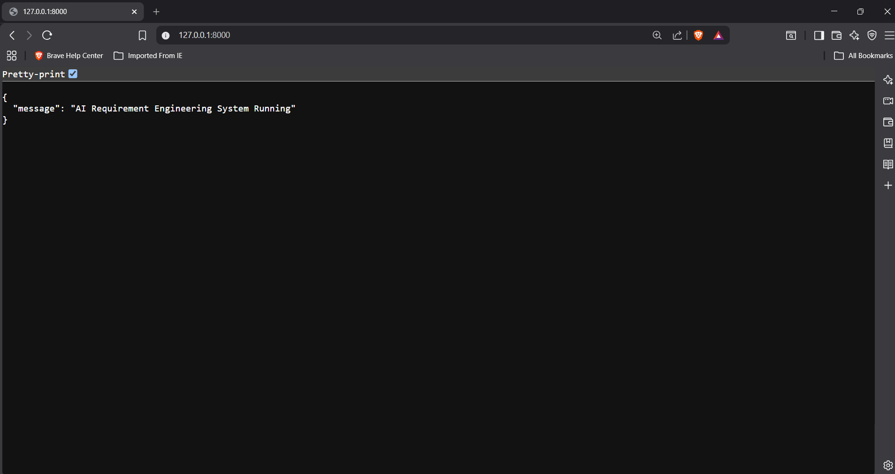
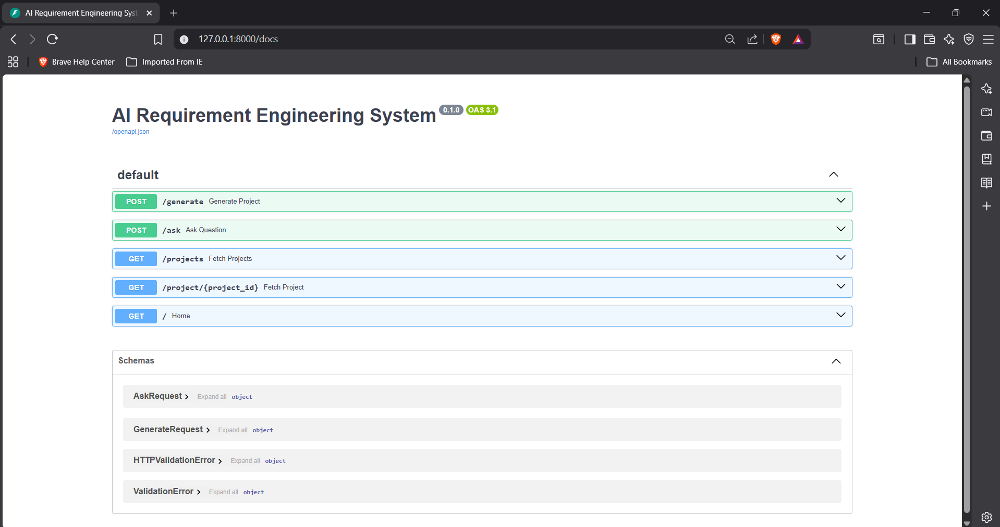
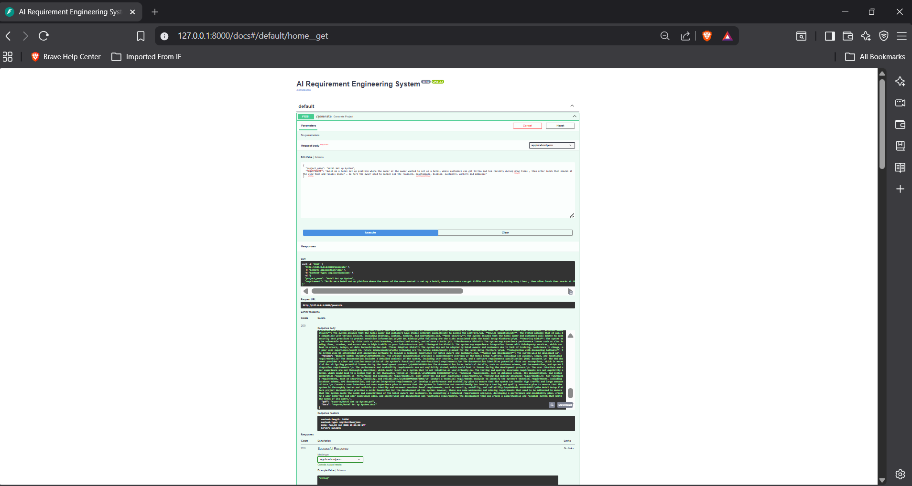
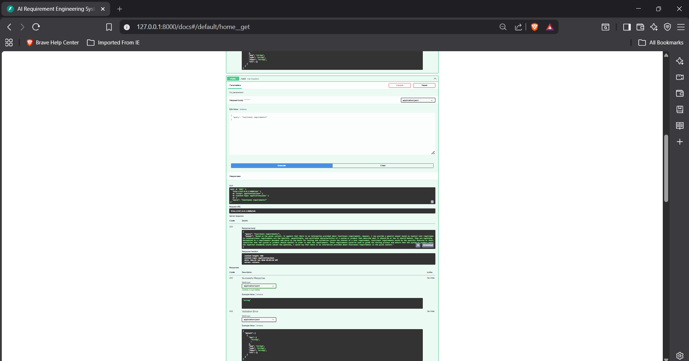
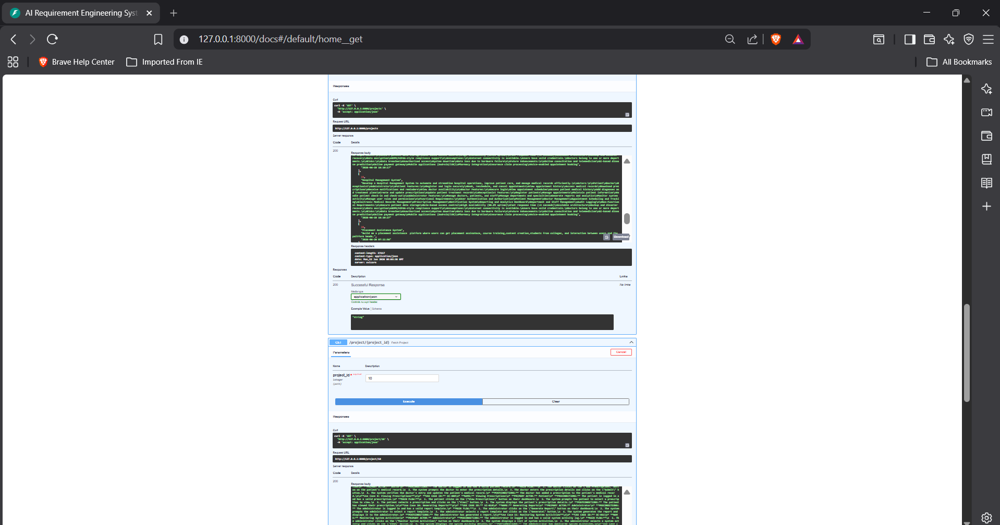
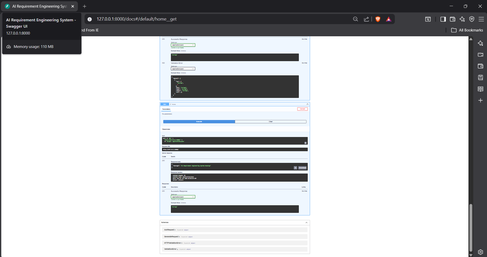

### Project Running
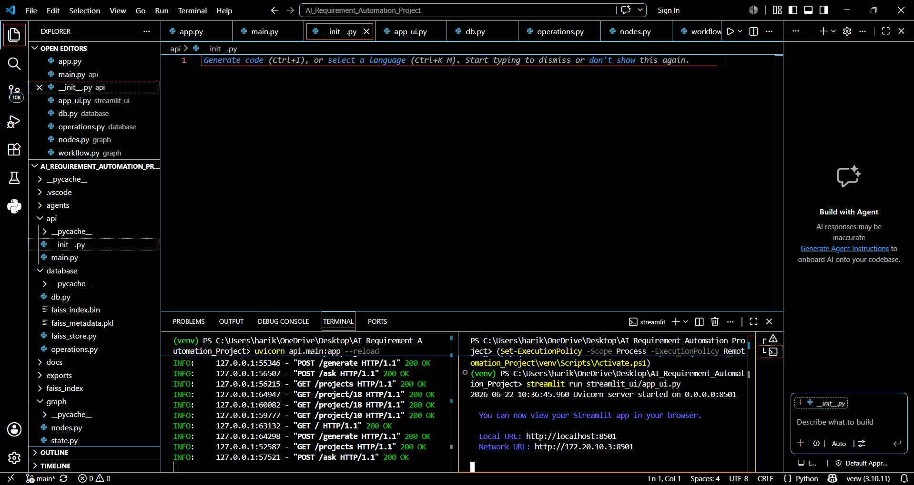

### Streamlit Frontend

# generate project
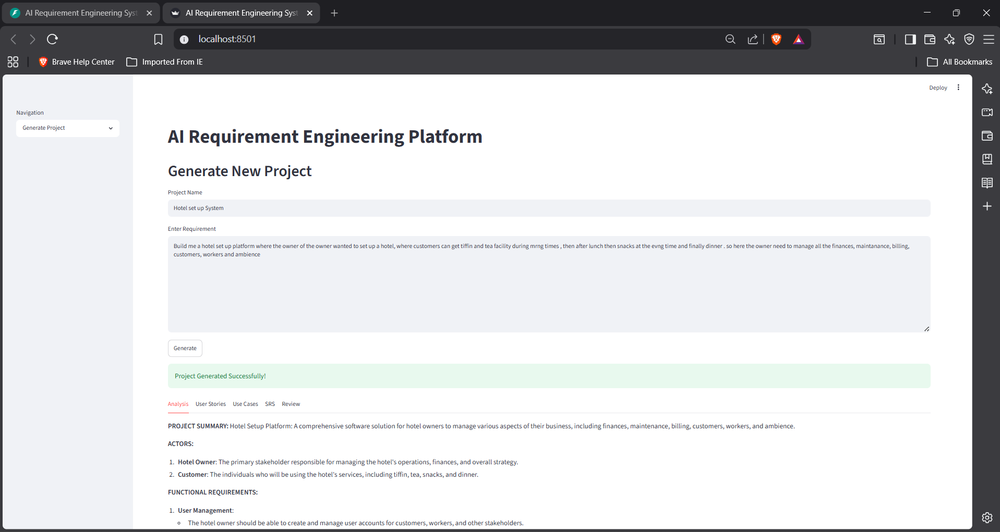
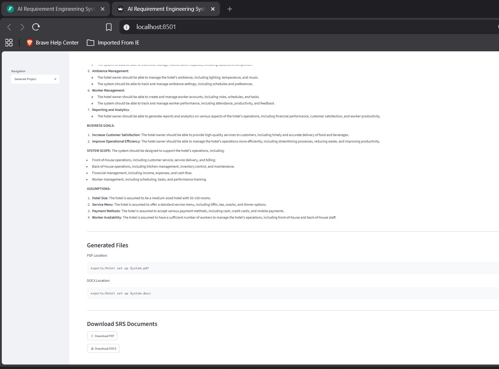

# View project
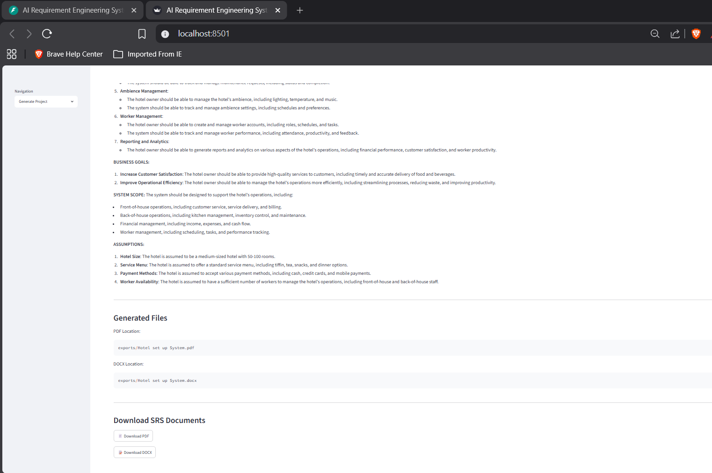
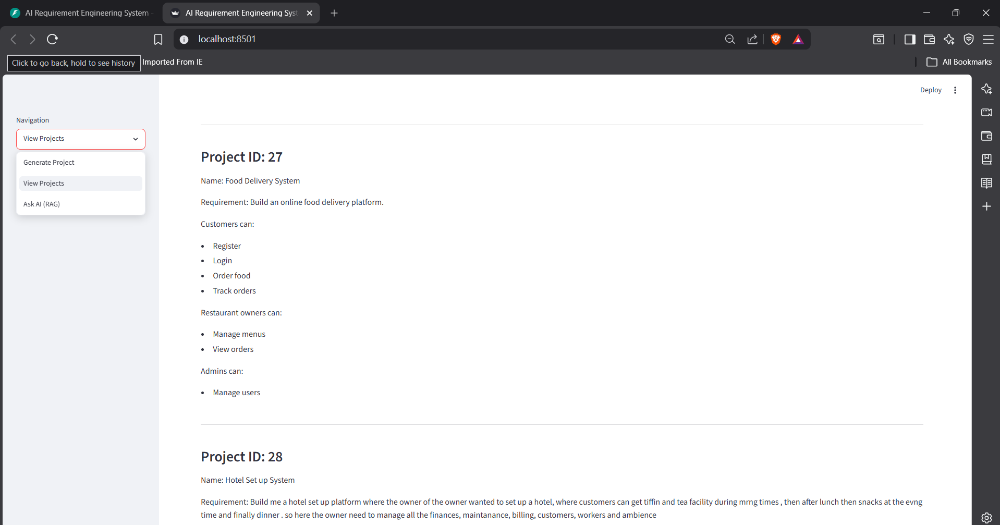

# Rag query AI
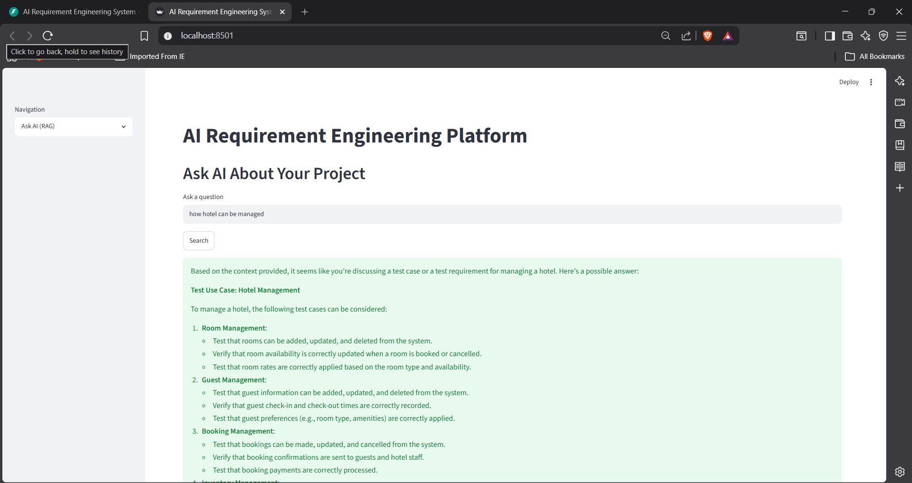

## 🚀 Installation

### Clone Repository

```bash
git clone <repository-url>
cd AI-Requirement-Engineering-System
```

### Create Virtual Environment

```bash
python -m venv venv
```

### Activate Environment

```bash
venv\Scripts\activate
```

### Install Dependencies

```bash
pip install -r requirements.txt
```

### Configure Environment Variables

Create a `.env` file:

```env
GROQ_API_KEY=your_api_key
```

---

## ▶️ Run Application

### Start FastAPI Backend

```bash
uvicorn api.main:app --reload
```

### Start Streamlit Frontend

```bash
streamlit run streamlit_ui/app_ui.py
```

---

## 📊 Example Outputs

* Requirement Analysis
* Ambiguity Report
* User Stories
* Use Cases
* Software Requirement Specification
* PDF Documentation
* DOCX Documentation

---

## 🔮 Future Enhancements

* User Authentication
* Role-Based Access Control
* Docker Containerization
* Cloud Deployment
* PostgreSQL Integration
* CI/CD Pipelines
* Requirement Versioning
* Multi-Language Support

## 👩‍💻 Author

Harika Satti
